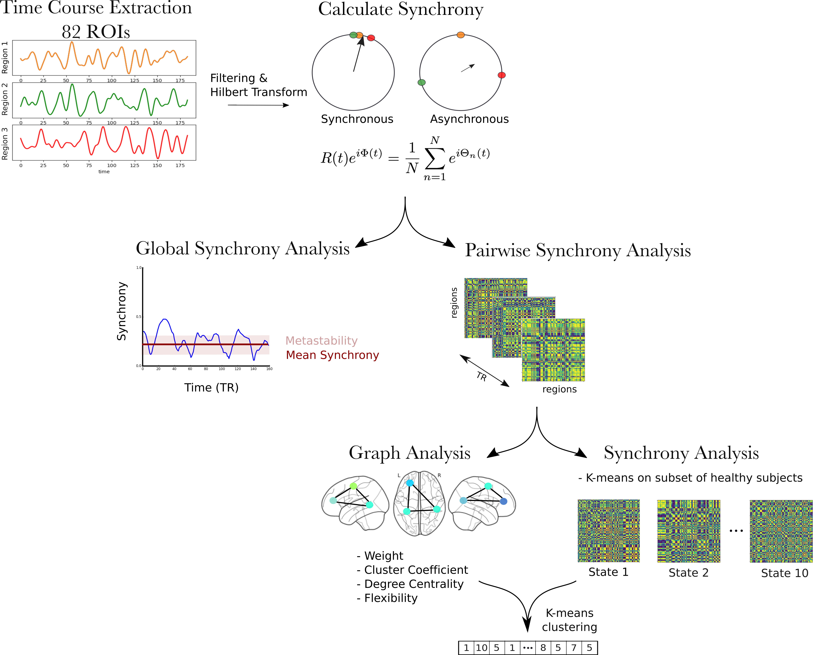

# Analysis of the Metastable Dynamics in Schizophrenia

This repo contains the code for the 
[poster](https://drive.google.com/file/d/1RT4QxoDAQNrv-aoiN9Ey150WJFhXoxKE/view?usp=sharing) presented at OHBM 2017.

## Abstract
Brain activity is characterised by the spontaneous formation and decomposition
of functional networks over time. While during rest
the brain exists in a critical state, in which the information transfer, 
storage capacity, and sensitivity to external inputs are maximised, 
subcritical dynamics are observed during cognitive tasks. 
Schizophrenic patients show an altered E/I balance and consequently 
altered functional dynamics. Here, we aimed to analyse changes in two
important dynamic measures – synchrony and
metastability – between healthy controls and schizophrenic patients
during rest and the performance of a task.

## Dataset
The dataset used on this project is openly available at the OpenfMRI dataset
and can be downloaded [here](https://www.openfmri.org/dataset/ds000030/).

